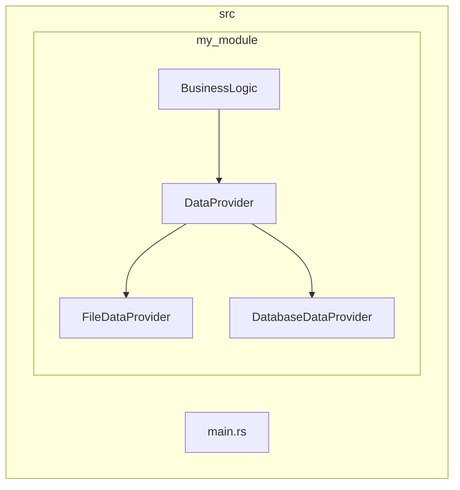
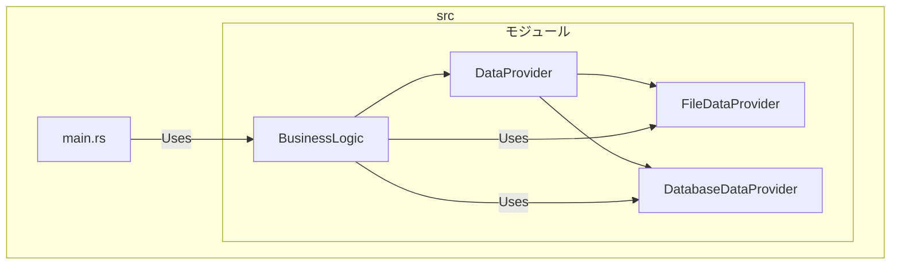

# rustで 疎結合ってどうやんの?

DIP(dependency Inversion Principal)

rustにおけるclean architectureってどうやってやるんだ?
まじで正解だとは思ってないけど、とりあえず...

### ポイント

・BusinessLogicはDataProviderのtraitに依存している

-> FileDataProviderやDatabaseDataProviderの実際の処理はDataProviderのtraitさえ実装していればあとはどうでもいい

全体の処理としては以下のような流れ

