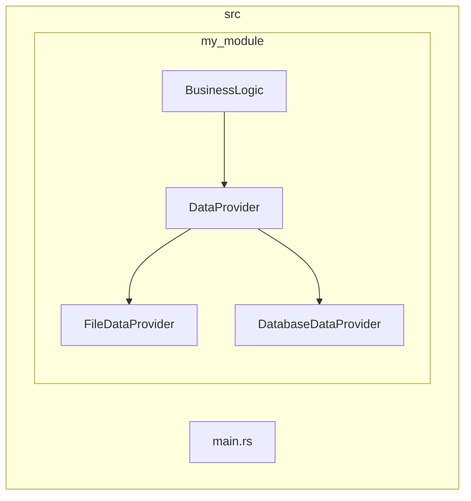
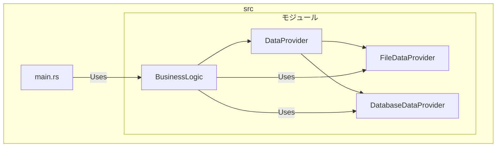
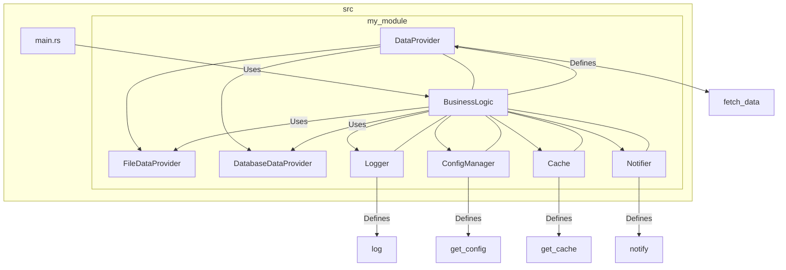

# rustで 疎結合ってどうやんの?

DIP(dependency Inversion Principal)

rustにおけるclean architectureってどうやってやるんだ?
まじで正解だとは思ってないけど、とりあえず...

### ポイント

・BusinessLogicはDataProviderのtraitに依存している

-> FileDataProviderやDatabaseDataProviderの実際の処理はDataProviderのtraitさえ実装していればあとはどうでもいい



全体の処理としては以下のような流れ



### さらに複雑にしていくと...

ライフサイクルの問題がでくる?



以下 各種trait
```rust
// src/my_module/logger.rs
pub trait Logger {
    fn log(&self, message: &str);
}

// src/my_module/config_manager.rs
pub trait ConfigManager {
    fn get_config(&self) -> String;
}

// src/my_module/cache.rs
pub trait Cache {
    fn get_cache(&self) -> String;
}


// src/my_module/notifier.rs
pub trait Notifier {
    fn notify(&self, message: &str);
}
```

BusinessLogicの部分が大変か...
```rust

// src/my_module/business_logic.rs
use crate::my_module::data_provider::DataProvider;
use crate::my_module::logger::Logger;
use crate::my_module::config_manager::ConfigManager;
use crate::my_module::cache::Cache;
use crate::my_module::notifier::Notifier;

pub struct BusinessLogic<'a, DP: DataProvider, L: Logger, CM: ConfigManager, C: Cache, N: Notifier> {
    data_provider: &'a DP,
    logger: &'a L,
    config_manager: &'a CM,
    cache: &'a C,
    notifier: &'a N,
}

impl<'a, DP: DataProvider, L: Logger, CM: ConfigManager, C: Cache, N: Notifier> BusinessLogic<'a, DP, L, CM, C, N> {
    pub fn new(
        data_provider: &'a DP,
        logger: &'a L,
        config_manager: &'a CM,
        cache: &'a C,
        notifier: &'a N,
    ) -> Self {
        BusinessLogic {
            data_provider,
            logger,
            config_manager,
            cache,
            notifier,
        }
    }

    pub fn execute(&self) {
        let data = self.data_provider.fetch_data();
        self.logger.log(&format!("Fetched data: {}", data));
        let config = self.config_manager.get_config();
        let cache = self.cache.get_cache();
        self.notifier.notify(&format!("Config: {}, Cache: {}", config, cache));
    }
}
```

main.rs
```rust

// src/main.rs
use my_module::data_provider::{DataProvider, FileDataProvider, DatabaseDataProvider};
use my_module::logger::Logger;
use my_module::config_manager::ConfigManager;
use my_module::cache::Cache;
use my_module::notifier::Notifier;
use my_module::business_logic::BusinessLogic;

struct ConsoleLogger;
impl Logger for ConsoleLogger {
    fn log(&self, message: &str) {
        println!("LOG: {}", message);
    }
}

struct SimpleConfigManager;
impl ConfigManager for SimpleConfigManager {
    fn get_config(&self) -> String {
        "Config value".to_string()
    }
}

struct InMemoryCache;
impl Cache for InMemoryCache {
    fn get_cache(&self) -> String {
        "Cache value".to_string()
    }
}

struct EmailNotifier;
impl Notifier for EmailNotifier {
    fn notify(&self, message: &str) {
        println!("Notification: {}", message);
    }
}

fn main() {
    let file_provider = FileDataProvider;
    let database_provider = DatabaseDataProvider;
    let logger = ConsoleLogger;
    let config_manager = SimpleConfigManager;
    let cache = InMemoryCache;
    let notifier = EmailNotifier;

    let business_logic = BusinessLogic::new(
        &file_provider,
        &logger,
        &config_manager,
        &cache,
        &notifier,
    );

    business_logic.execute();
}
```